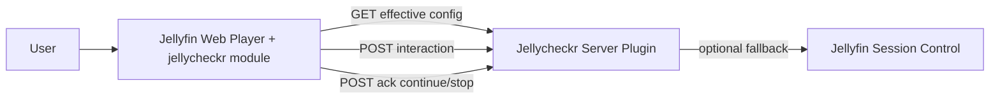
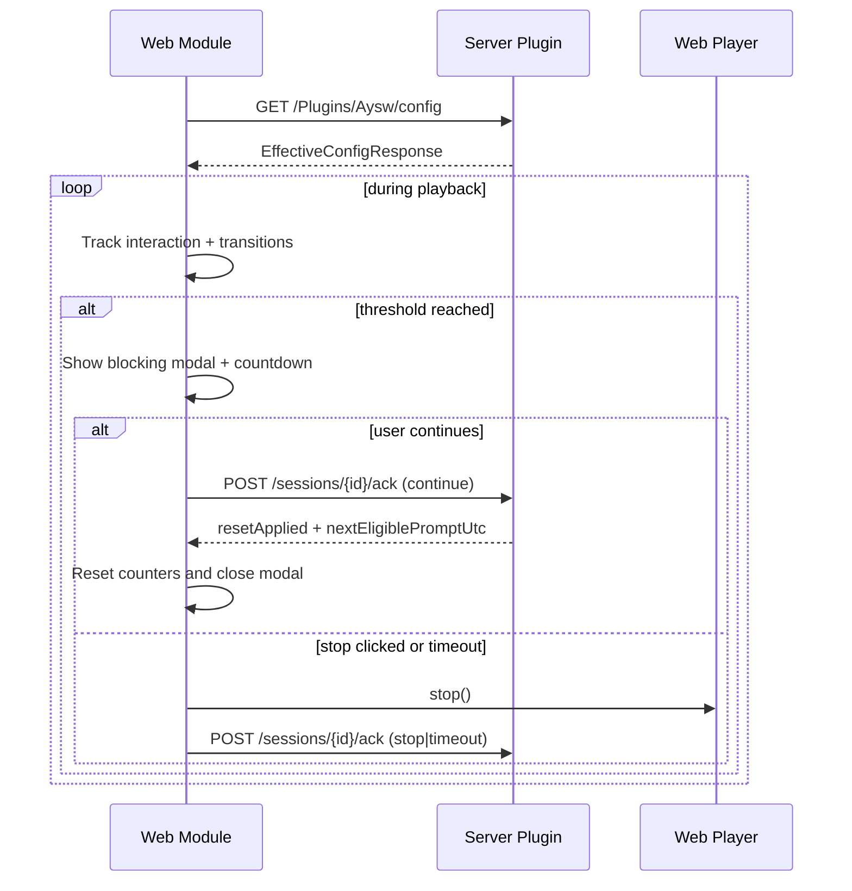

# Architecture

## Overview

`jellycheckr` v1 has two runtime components:

1. Server plugin: central policy/configuration/session tracking and optional fallback enforcement
2. Jellyfin Web module: prompt UX, interaction tracking, transition detection, and ack flow

## Component Diagram

## Playback Prompt Flow

## Design Decisions

- Policy thresholds are server-owned and returned as effective config.
- Interaction quality is client-owned because server cannot infer user intent reliably.
- Session state persistence is in-memory for v1; configuration persists to disk.
- Plugin web assets are published into the plugin folder (`web/`) and served by plugin routes; only the dashboard config page shim remains embedded.
- API contracts are versioned and mirrored through `packages/contracts`.
